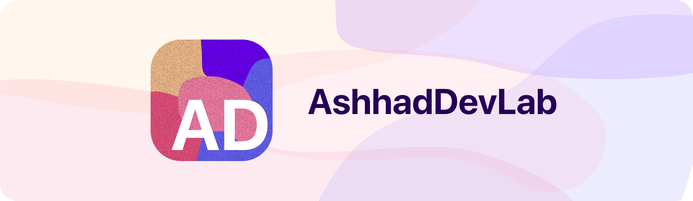

<picture>
  <source media="(prefers-color-scheme: dark)" srcset="./adDevBannerDark.svg">
  <source media="(prefers-color-scheme: light)" srcset="./adDevBannerLight.svg">
  
</picture>

# 👋 Hi, I'm Ashhad Ahmed.
A designer and developer. I love new technologies, and am constantly looking for something interesting to play around with. If you've got something, let me know!

> Check out my newest project, Enigma Guard. Download it today!
> 
> 

## ✨ Skills

> What can I do?

### General

- Front-End devlopment
  - Tkinter
  - Vanilla JS Framework
  - Three.js
- Back-End developnment
  - vite
  - Electron.js

### Fluent Languages

- Python
- HTML
- CSS
- English

### Python Specific Databases

- PyMongo
- SQLite

## 👾 Software
> What's on my computer?

- IDE: [VSCode](https://code.visualstudio.com/)
- Design Software: [Figma](https://figma.com)
- Browser: [Opera GX](https://opera.com/gx)
- 3D Modeling Software: [Blender](https://blender.org)

## 💻 Hardware

> What do I use?

- Computer: 10th Gen 15-10400F | Gigabyte B560M Gaming HD Motherboard | 16GB Ram XPG
- Keyboard: AOC GK500 Blue Switches
- Mouse: Razer Viper Mini

## 📈 Stats
> How much do I do what I do?

